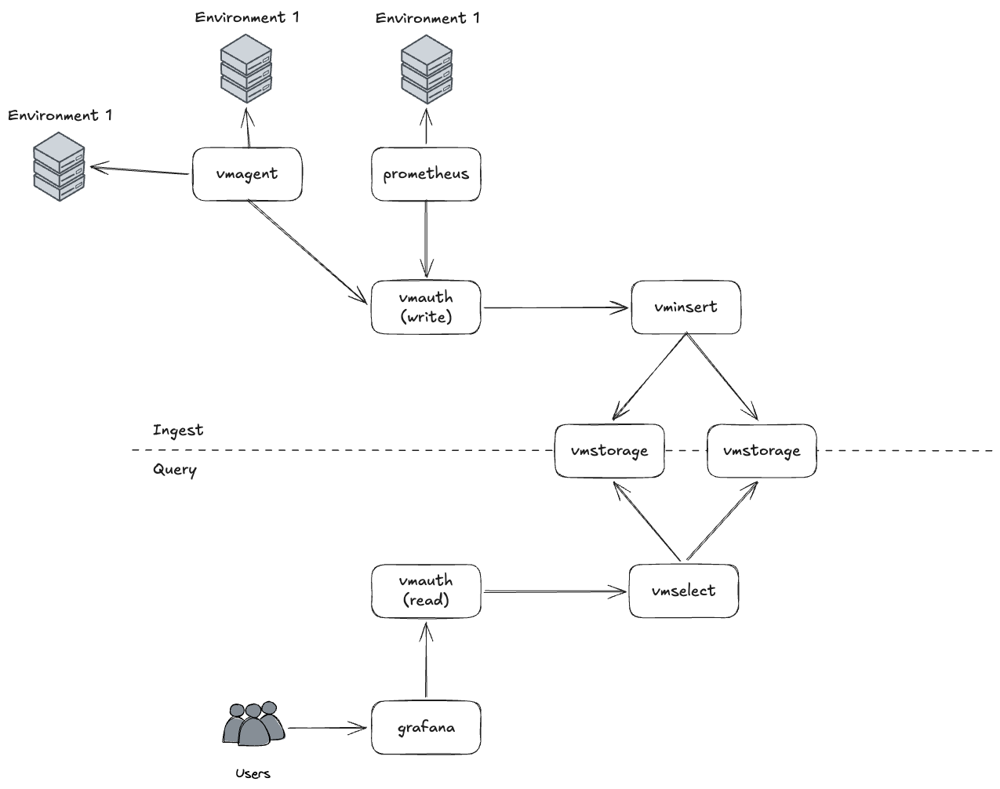

# VictoriaMetrics Multi-Tenant Cluster

A Docker Compose deployment of a Victoria Metrics cluster with multi-tenancy, per-path basic authentication, cluster self-monitoring, and Grafana.

---

## Architecture Overview

```
                         ┌──────────────────────────────────────────────────┐
                         │               Docker Network: vm-cluster         │
                         │                                                  │
                         │   ┌─────────────┐       ┌─────────────┐          │
  Write clients  ───────►│   │ vmauth-write│──────►│  vminsert   │          │
  :8480 (host)           │   │  :8427      │       │  :8480      │          │
                         │   └─────────────┘       └──────┬──────┘          │
                         │                                │                 │
                         │                        ┌───────▼──────┐          │
                         │                        │  vmstorage   │          │
                         │                        │  :8482 (HTTP)│          │
                         │                        │  :8400 (ins) │          │
                         │                        │  :8401 (sel) │          │
                         │                        └───────┬──────┘          │
                         │                                │                 │
                         │   ┌─────────────┐       ┌──────▼──────┐          │
  Read clients   ───────►│   │ vmauth-read │──────►│  vmselect   │          │
  :8481 (host)           │   │  :8427      │       │  :8481      │          │
                         │   └─────────────┘       └─────────────┘          │
                         │                                                  │
                         │   ┌─────────────┐                                │
                         │   │   vmagent   │── scrapes /metrics ──► all     │
                         │   │  :8429      │── remote_write ──► vmauth-write│
                         │   └─────────────┘   (common tenant, acctID=0)    │
                         │                                                  │
                         │   ┌─────────────┐                                │
                         │   │   Grafana   │── queries ──► vmauth-read      │
                         │   │  :3000      │                                │
                         │   └─────────────┘                                │
                         └──────────────────────────────────────────────────┘
```



---

## Services

| Service | Image | Host Port | Container Port | Role |
|---------|-------|-----------|----------------|------|
| `vmauth-write` | victoriametrics/vmauth | **8480** | 8427 | Authenticated write gateway |
| `vmauth-read` | victoriametrics/vmauth | **8481** | 8427 | Authenticated read gateway |
| `vminsert` | victoriametrics/vminsert | 8485 | 8480 | Ingest / fan-out to storage |
| `vmselect` | victoriametrics/vmselect | 8486 | 8481 | Query / merge from storage |
| `vmstorage` | victoriametrics/vmstorage | 8482 | 8482, 8400, 8401 | Persistent time-series storage |
| `vmagent` | victoriametrics/vmagent | 8429 | 8429 | Scrape agent + forwarder |
| `grafana` | grafana/grafana | **3000** | 3000 | Dashboards |

Ports **8480**, **8481**, and **3000** are the only externally-facing entry points for data traffic. All other ports are either internal-only or direct web UI access.

---

## Tenants

Tenant isolation is enforced by routing different credentials to different URL prefixes on vminsert/vmselect. VictoriaMetrics uses the `accountID` in the path as the namespace — data written to one `accountID` is completely invisible to queries against a different one.

| Tenant | accountID | Write credential | Read credential |
|--------|-----------|-----------------|-----------------|
| tenant1 | `1` | `tenant1` / `secret1` | `tenant1` / `secret1` |
| tenant2 | `2` | `tenant2` / `secret2` | `tenant2` / `secret2` |
| common *(cluster metrics)* | `0` | `vmagent` / `agentsecret` | `admin` / `adminsecret` |

---

## Write Path

```
Client
  │
  │  POST /api/v1/write  (or /api/v1/import/prometheus, etc.)
  │  Authorization: Basic <tenant1:secret1>
  │
  ▼
vmauth-write  (:8480 host → :8427 container)
  │
  │  Looks up credential → resolves url_prefix
  │  tenant1  → http://vminsert:8480/insert/1/prometheus
  │  tenant2  → http://vminsert:8480/insert/2/prometheus
  │  vmagent  → http://vminsert:8480/insert/0/prometheus
  │
  │  Proxies request: appends original path to url_prefix
  │  e.g. POST /api/v1/write → /insert/1/prometheus/api/v1/write
  │
  ▼
vminsert  (:8480 internal)
  │
  │  Receives Prometheus remote-write (protobuf) or plain-text import
  │  Encodes tenant accountID from the URL path segment
  │  Fans out data to all vmstorage nodes (here: single node)
  │
  ▼
vmstorage  (:8400 vminsert port)
  │
  └── Data persisted to /storage with tenant accountID embedded
      Retention: 1 month (configurable via --retentionPeriod)
```

### Key points

- **Clients only ever talk to vmauth-write on `:8480`** — vminsert is never directly exposed.
- The `url_prefix` in [config/vmauth-write.yml](config/vmauth-write.yml) maps each credential to an `accountID`; changing the prefix is all that's needed to add or re-assign a tenant.
- Wrong credentials → `401 Unauthorized` before reaching vminsert.
- vmagent writes cluster self-metrics to `accountID=0` (common tenant) using its own credential (`vmagent`/`agentsecret`).

---

## Read Path

```
Client (Grafana, curl, etc.)
  │
  │  GET /api/v1/query?query=up
  │  Authorization: Basic <tenant1:secret1>
  │
  ▼
vmauth-read  (:8481 host → :8427 container)
  │
  │  Looks up credential → resolves url_prefix
  │  tenant1  → http://vmselect:8481/select/1/prometheus
  │  tenant2  → http://vmselect:8481/select/2/prometheus
  │  admin    → http://vmselect:8481/select/0/prometheus
  │
  │  Proxies request: appends original path to url_prefix
  │  e.g. GET /api/v1/query → /select/1/prometheus/api/v1/query
  │
  ▼
vmselect  (:8481 internal)
  │
  │  Issues query scoped to accountID from URL path
  │  Merges results from all vmstorage nodes
  │  Returns standard Prometheus HTTP API response
  │
  ▼
vmstorage  (:8401 vmselect port)
  │
  └── Scans only data belonging to the requested accountID
      Cross-tenant data is never returned
```

### Key points

- **Clients only ever talk to vmauth-read on `:8481`** — vmselect is never directly exposed for data queries.
- A tenant using `tenant1` credentials **cannot** see `tenant2` data even if they construct a matching PromQL query — the `accountID` is injected at the proxy layer, not by the client.
- Grafana is provisioned with three datasources, one per tenant, each supplying different credentials to vmauth-read.
- The `admin` credential reads from `accountID=0` — the common tenant where vmagent stores cluster component metrics.

---

## Observability (Self-Monitoring)

vmagent scrapes the `/metrics` endpoint of every cluster component every 15 seconds and remote-writes all scraped data to the common tenant (`accountID=0`) via vmauth-write.

**Scrape targets** (defined in [config/vmagent.yml](config/vmagent.yml)):

| Job | Target | `component` label |
|-----|--------|-------------------|
| `vmstorage` | `vmstorage:8482` | `vmstorage` |
| `vminsert` | `vminsert:8480` | `vminsert` |
| `vmselect` | `vmselect:8481` | `vmselect` |
| `vmauth-write` | `vmauth-write:8427` | `vmauth-write` |
| `vmauth-read` | `vmauth-read:8427` | `vmauth-read` |
| `vmagent` | `vmagent:8429` | `vmagent` |

**Remote write** (via CLI flags in [docker-compose.yml](docker-compose.yml)):
```
--remoteWrite.url=http://vmauth-write:8427/api/v1/write
--remoteWrite.basicAuth.username=vmagent
--remoteWrite.basicAuth.password=agentsecret
```

This means vmagent's own metrics also pass through authentication, the same as any external write client.

---

## Grafana

**URL:** http://localhost:3000 — `admin` / `admin`

### Datasources

| Name | Default | Credential | Reads from |
|------|---------|-----------|------------|
| VictoriaMetrics - Common | ✓ | admin / adminsecret | accountID=0 (cluster metrics) |
| VictoriaMetrics - Tenant1 | | tenant1 / secret1 | accountID=1 |
| VictoriaMetrics - Tenant2 | | tenant2 / secret2 | accountID=2 |

### Provisioned Dashboards

| Dashboard | Best datasource | Purpose |
|-----------|----------------|---------|
| VictoriaMetrics - cluster | Common | vminsert/vmselect/vmstorage performance |
| VictoriaMetrics - vmagent | Common | Scrape targets, WAL queue, send rate |
| VictoriaMetrics - vmauth | Common | Auth request rates, errors per user |
| VictoriaMetrics Cluster Per Tenant Statistic | Common | Per-tenant ingestion and query breakdown |

---

## Web UIs (direct access, no auth required)

These are internal service UIs exposed directly for operational convenience. They do not serve tenant data queries.

| URL | Service |
|-----|---------|
| http://localhost:8482 | vmstorage — storage stats, retention info |
| http://localhost:8485 | vminsert — active connections, ingestion rate |
| http://localhost:8486/vmui | vmselect — VMUI (defaults to no tenant scope) |
| http://localhost:8429 | vmagent — scrape targets, WAL stats, config |

### VMUI per tenant

VMUI is served by vmselect on port `8486`. Navigating to a tenant-scoped path queries only that tenant's data — no authentication is required as vmselect is exposed directly (bypassing vmauth-read).

| Tenant | VMUI URL |
|--------|----------|
| tenant1 | http://localhost:8486/select/1/prometheus/vmui |
| tenant2 | http://localhost:8486/select/2/prometheus/vmui |
| common (cluster metrics, accountID=0) | http://localhost:8486/select/0/prometheus/vmui |

---

## Quick Start

```bash
docker compose up -d
```

### Write a metric (tenant1)

```bash
curl -u tenant1:secret1 \
  -X POST http://localhost:8480/api/v1/import/prometheus \
  --data 'my_metric{env="prod"} 1.23'
```

### Query it back

```bash
curl -u tenant1:secret1 \
  "http://localhost:8481/api/v1/query?query=my_metric"
```

### Verify tenant isolation

```bash
# Returns empty — tenant2 cannot see tenant1's data
curl -u tenant2:secret2 \
  --data-urlencode 'query=my_metric{env="prod"}' \
  http://localhost:8481/api/v1/query
```

### Query cluster self-metrics (common tenant)

```bash
curl -u admin:adminsecret \
  --data-urlencode 'query=vm_app_uptime_seconds' \
  http://localhost:8481/api/v1/query
```

---

## File Structure

```
.
├── docker-compose.yml
├── config/
│   ├── vmauth-write.yml     # Write-path auth: credential → accountID URL prefix
│   ├── vmauth-read.yml      # Read-path auth:  credential → accountID URL prefix
│   └── vmagent.yml          # Scrape targets for cluster self-monitoring
└── grafana/
    └── provisioning/
        ├── datasources/
        │   └── datasources.yml          # Three pre-configured datasources
        └── dashboards/
            ├── dashboards.yml           # File-based dashboard provider
            ├── victoriametrics-cluster.json
            ├── vmagent.json
            ├── vmauth.json
            └── clusterbytenant.json
```

---

## Adding a New Tenant

1. Add a write entry to [config/vmauth-write.yml](config/vmauth-write.yml):
   ```yaml
   - username: "tenant3"
     password: "secret3"
     url_prefix: "http://vminsert:8480/insert/3/prometheus"
   ```

2. Add a read entry to [config/vmauth-read.yml](config/vmauth-read.yml):
   ```yaml
   - username: "tenant3"
     password: "secret3"
     url_prefix: "http://vmselect:8481/select/3/prometheus"
   ```

3. Reload vmauth (hot-reload supported — no restart needed):
   ```bash
   docker compose kill -s SIGHUP vmauth-write vmauth-read
   ```

4. Optionally add a Grafana datasource for the new tenant in [grafana/provisioning/datasources/datasources.yml](grafana/provisioning/datasources/datasources.yml) and restart Grafana.
# vicmet
